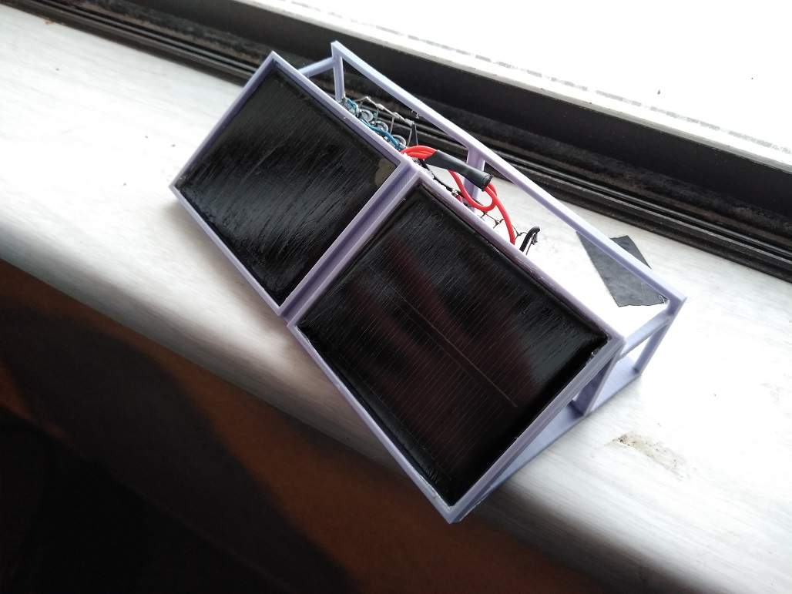
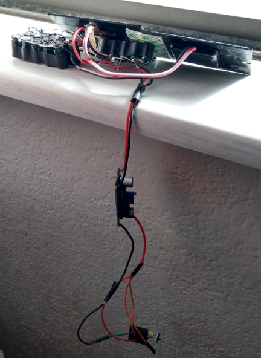

# NOTE:
The main issue with this project is the startup current of the voltage step down device... it is hard to overcome. I had to short/jump the capacitors to overcome it/get the converter to start working... may consider using a supercap instead with a linear 3.3V regulator. Not saying that will work but it's less parts and less internal current to overcome.

# esp8266 solar emitter
This is a project idea I had to power an ESP01 with a bank of capacitors charged by solar cells and a DC to DC convert, it does work.

## About
Currenlty all this does aside from working physically, is just emit an `HTTP POST` request which is just "proof that it works". That is... the ESP is being kept alive by the sun. But the ESP01 has 4 analog pins potentially so it's possible I'll put them to use.

More details [here](https://medium.com/@jdc_cunningham/solar-cell-cap-bank-emitter-with-esp8266-esp01-db9c5df32314)

## Specs/parts
* 2 x 5V 100mA solar cells
* 10 x 6.3v 1000uF capacitors
* 10 x 50v 470uF capacitors (I’m aware these don’t match)
* 1 DC-DC LM2596 voltage regulator
* 1 ESP8266 ESP01 (8 pins)
* 1 USB to serial adapter CH340
* Misc parts eg. a button, a switch and a diode to prevent back flow into the cells

## Current thoughts
Although initially I just wanted 1 solar  cell, but the solar cell produces at best 100mA of current. I will have to work out the math if it's possible to power it, the caps have to charge for a second with two cells. Then the ESP01 can be "fully plugged in" after that if the sunlight is ample it continues to power itself. I'm not sure if it gets dark/cloudy and the sun comes back, the caps won't be able to charge while the ESP01 is trying to draw power(more than idle). Specifically I'm referring to `CH_PD` being connected to the external `3.3v` to make it run code.

Edit: actually it is able to charge up from dead, just takes a bit.

## First prototype
So this took me a while to do, because I ran into a lot of problems(like just basic communication to program it). Then the hacky USB to serial adapter to program it, plus the jumping required to make it run code as well(mentioned above). You can see my programmer further down what it looks like.

This is what I have that is working, more caps, another cell. I think the other cell is more important than the extra caps.

